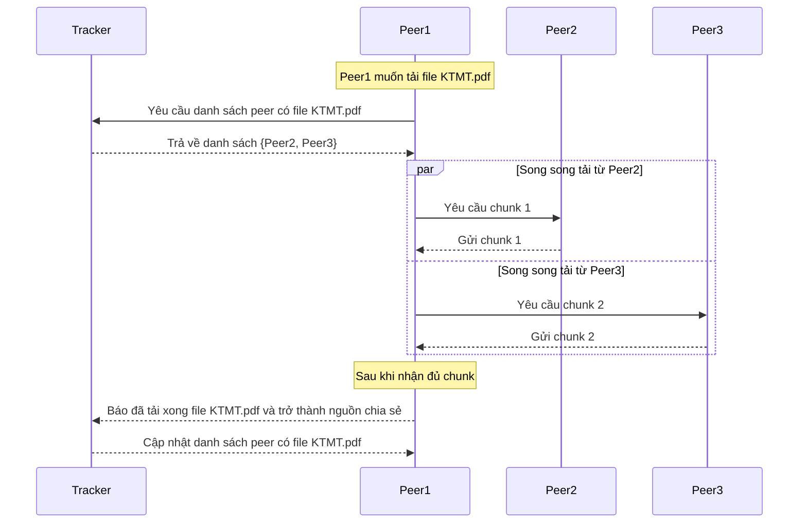

# 📂 MMT-P2P-Parallel

Hệ thống **P2P song song** mô phỏng cách chia sẻ và tải file qua nhiều peer trong mạng ngang hàng (peer-to-peer).

## ⚙️ Kiến trúc hệ thống

### 1. 🛰️ Tracker
- Vai trò như **máy chủ điều phối**.
- Lưu trữ thông tin:
  - Danh sách file đang được chia sẻ.
  - Danh sách các peer đang online.
  - Ánh xạ file ↔ danh sách peer có file đó.
- Tracker **không lưu file**, chỉ giữ metadata.
- Cung cấp API RESTful:
  - `POST /announce` → Peer báo cáo IP, port, danh sách file đang chia sẻ.
  - `GET /files` → Trả về danh sách file trên hệ thống.
  - `GET /file/{filename}` → Trả về metadata file + danh sách peer đang giữ file.

### 2. 💻 Peer
- Là các client tham gia mạng P2P.
- Có 2 chức năng chính:
  - **Chia sẻ file**: Peer khởi động một server mini, lắng nghe request tải file từ peer khác.
  - **Tải file song song**: Peer nhận danh sách peer có file từ Tracker → kết nối trực tiếp tới nhiều peer để tải các chunk của file đồng thời.
- Peer sử dụng CLI với các lệnh:
  - `peer announce <ip> <port> <folder>` → đăng ký peer và file với Tracker.
  - `peer list` → xem danh sách file trên Tracker.
  - `peer info <filename>` → xem metadata và peer đang chia sẻ file.
  - `peer download <ip> <port> <folder> <filename>` → tải file về thư mục local.

### 3. 🔄 Quá trình tải file



## 🛰️ Tracker  

Tracker đóng vai trò **máy chủ trung tâm** trong hệ thống P2P:  
- Lưu thông tin các Peer đang online.  
- Quản lý danh sách file mà từng Peer đang chia sẻ.  
- Cung cấp API để các Peer **announce**, **hoàn tất tải**, và **yêu cầu danh sách nguồn**.  

### 📂 Source Structure

```
tracker/
│── app/ # Source chính của Tracker
│ ├── api.py # Định nghĩa các endpoint FastAPI (announce, get_files, complete, …)
│ ├── main.py # Entry point khởi chạy FastAPI app
│ ├── models.py # Định nghĩa dữ liệu (Peer, File, Request/Response schema)
│ ├── services.py # Xử lý logic (quản lý Peer, update file list, lookup file)
│ └── store.py # Lưu trữ dữ liệu tạm (in-memory database hoặc dict)
│
│── tests/ # Unit tests cho Tracker API
│ ├── test_api_announce.py # Test API announce từ Peer
│ ├── test_api_complete.py # Test API báo hoàn tất tải
│ ├── test_api_get_file.py # Test lấy thông tin một file cụ thể
│ └── test_api_get_files.py # Test lấy danh sách toàn bộ file
│
│── Dockerfile # Docker build file cho Tracker service
```

---

### LIST API

1. `POST /announce` Peer thông báo cho Tracker biết nó đang online và chia sẻ những file nào.

**Request body:**
```JSON
{
  "ip": "192.168.1.10",
  "port": 7001,
  "files": [
    {"name": "KTMT.pdf", "size": 102400, "sha256": "abcd1234..."},
    {"name": "OS.pptx", "size": 204800, "sha256": "efgh5678..."}
  ]
}
```


2. `POST /complete` Peer báo cho Tracker khi đã tải xong một file, để trở thành nguồn chia sẻ mới.

**Request body:**
```JSON
{
  "peer_ip": "192.168.1.20",
  "port": 7002,
  "name": "KTMT.pdf"
}
```

3. `GET /file/KTMT.pdf` Peer yêu cầu danh sách peer đang giữ file cụ thể.

**Response:**
```JSON
{
  "file": {
    "name": "KTMT.pdf",
    "size": 102400,
    "sha256": "abcd1234..."
  },
  "peers": [
    {"ip": "192.168.1.10", "port": 7001},
    {"ip": "192.168.1.20", "port": 7002}
  ]
}
```

4. `GET /files` Lấy danh sách tất cả các file đang có trên Tracker.

**Response:**
```JSON
[
  {"name": "KTMT.pdf", "size": 102400, "sha256": "abcd1234..."},
  {"name": "OS.pptx", "size": 204800, "sha256": "efgh5678..."}
]
```

---

### Test `pytest -v tests/` và Run Server `python3 -m app.main`

---

## 💻 Peer

### 📡 Mở port

Peer mở một socket TCP server, lắng nghe kết nối từ các peer khác.  
Khi nhận được request dạng `filename:start:end`, peer sẽ đọc đúng phần dữ liệu trong file và gửi lại.  
Điều này cho phép **chia sẻ từng phần (chunk)** của file thay vì gửi toàn bộ, phục vụ cơ chế tải song song.

```py
with socket.socket(socket.AF_INET, socket.SOCK_STREAM) as s:
    s.bind(("0.0.0.0", port))
    s.listen()
    print(f"Peer listening on {port}, sharing {folder}")
    while True:
        conn, addr = s.accept()
        threading.Thread(target=handle_client, args=(conn, addr), daemon=True).start()
```

### 📜 Danh sách các lệnh chạy

- Khởi động peer và mở port để chia sẻ thư mục:
```sh
python -m app.main run 127.0.0.1 7001 ./shared/p1

Peer listening on 7001, sharing ./shared/p1
Announce: {'ok': True}
Peer listening on 7001, sharing ./shared/p1
Press Ctrl+C to stop.
```

- Xem danh sách file đang có trên tracker:
```sh
python -m app.main peer list

Files on tracker:
- KTMT.pdf (17732905 bytes)
- MMT.pdf (76411 bytes)
- big.bin (1073741824 bytes)
- big3.bin (3221225472 bytes)
```

- Xem thông tin file:
```sh
python3 -m app.main peer info KTMT.pdf

{'file': {'name': 'KTMT.pdf', 'size': 17732905, 'sha256': 'KTMT.pdf'}, 'peers': [{'ip': '127.0.0.1', 'port': 7001}]}
```


- Yêu cầu tải file từ các peer khác:
```sh
➜  peer git:(main) ✗ python3 -m app.main peer download 127.0.0.1 7003 ./shared/p3 big3.bin
big3.bin ━━━━━━━━━━━━━━━━━━━━━━━━━━━━━━━━━━━━━━━━ 100.00% 2.1 GB/s 0:00:00
✔ Chunk 0 downloaded from 127.0.0.1:9001 (3221225472 bytes) in 4.08s
Complete notify: {'ok': True}

➜  peer git:(main) ✗ python3 -m app.main peer download 127.0.0.1 7002 ./shared/p2 big3.bin
big3.bin ━━━━━━━━━━━━━━━━━━━━━━━━━━━━━━━━━━━━━━━━ 100.00% 111.1 MB/s 0:00:00
✔ Chunk 0 downloaded from 127.0.0.1:9001 (1610612736 bytes) in 3.22s
✔ Chunk 1 downloaded from 127.0.0.1:9003 (1610612736 bytes) in 3.98s
Complete notify: {'ok': True}
```

### ⚡ Multi-threading

1️⃣ Khái niệm Multi-threading

- **Thread** = luồng thực thi trong cùng một tiến trình (process).
- **Multi-threading** giúp chạy nhiều tác vụ đồng thời, nhưng Python có GIL, nên CPU-bound task (tính toán nặng) vẫn không chạy nhanh hơn nhiều.
- **I/O-bound task** (đọc file, mạng, request) mới thực sự được lợi.

2️⃣ Cách dùng threading module
```py
def greet(name, delay):
    for _ in range(3):
        print(f"Hello {name}")
        time.sleep(delay)

t1 = threading.Thread(target=greet, args=("Alice", 1))
t2 = threading.Thread(target=greet, args=("Bob", 1.5))

t1.start()
t2.start()
t1.join()
t2.join()
```

### Run code
- Server `PORT = 9000`
```sh
➜  tracker git:(main) ✗ python3 -m app.main 
INFO:     Uvicorn running on http://0.0.0.0:9000 (Press CTRL+C to quit)
INFO:     Started reloader process [85230] using WatchFiles
INFO:     Started server process [85241]
INFO:     Waiting for application startup.
INFO:     Application startup complete.
```

- Peer 1: `PORT = 9001`, Peer 2: `PORT = 9002`, Peer 3: `PORT = 9003`
```sh
python3 -m app.main run 127.0.0.1 9001 ./shared/p1 
python3 -m app.main run 127.0.0.1 9002 ./shared/p2 
python3 -m app.main run 127.0.0.1 9003 ./shared/p3 
```

- **download file**
```sh
➜  peer git:(main) ✗ python3 -m app.main peer info big3.bin                               
{'file': {'name': 'big3.bin', 'size': 3221225472, 'sha256': 'big3.bin'}, 'peers': [{'ip': '127.0.0.1', 'port': 9001}]}
➜  peer git:(main) ✗ python3 -m app.main peer download 127.0.0.1 9002 ./shared/p2 big3.bin
big3.bin ━━━━━━━━━━━━━━━━━━━━━━━━━━━━━━━━━━━━━━━━ 100.00% 1.7 GB/s 0:00:00
✔ Chunk 0 downloaded from 127.0.0.1:9001 (3221225472 bytes) in 4.25s
Complete notify: {'ok': True}
➜  peer git:(main) ✗ python3 -m app.main peer info big3.bin                               
{'file': {'name': 'big3.bin', 'size': 3221225472, 'sha256': 'big3.bin'}, 'peers': [{'ip': '127.0.0.1', 'port': 9001}, {'ip': '127.0.0.1', 'port': 9002}]}
➜  peer git:(main) ✗ python3 -m app.main peer download 127.0.0.1 9003 ./shared/p3 big3.bin
big3.bin ━━━━━━━━━━━━━━━━━━━━━━━━━━━━━━━━━━━━━━━━ 100.00% 109.4 MB/s 0:00:00
✔ Chunk 0 downloaded from 127.0.0.1:9001 (1610612736 bytes) in 3.31s
✔ Chunk 1 downloaded from 127.0.0.1:9002 (1610612736 bytes) in 4.00s
Complete notify: {'ok': True}
```


---

## 🐳 Setup Docker Compose

### 🐳 Setup Docker

- build docker
```
cd tracker && docker build -t tracker -f Dockerfile . 
cd peer && docker build -t peer -f Dockerfile . 
```

- Tạo Docker Network Trước khi chạy các container, tạo network để các peer và tracker giao tiếp: **Domain nội bộ (hostname):** Khi chạy container, Docker tự động gán hostname = container name. Peer/tracker có thể dùng hostname này để gọi nhau thay vì IP động. Ví dụ: trong network p2p-net, peer1 muốn gửi request tới tracker có thể dùng tracker:9000.


```sh
docker network create p2p-net
```

---

- Chạy Tracker

Tracker lắng nghe cổng 9000:

```sh
docker run -it --rm \
  --name tracker \
  --network p2p-net \
  -p 9000:9000 \
  tracker
```

- `--name tracker` → tên container  
- `--network p2p-net` → network chung  
- `-p 9000:9000` → map port host → container  

---

- Chạy các Peer

Mỗi peer lắng nghe 1 cổng riêng và chia sẻ folder file:

```sh
# Peer 1
docker run -it --rm \
  --name peer1 \
  --network p2p-net \
  -v $(pwd)/shared/p1:/app/shared/p1 \
  peer:latest run peer1 7001 ./shared/p1

# Peer 2
docker run -it --rm \
  --name peer2 \
  --network p2p-net \
  -v $(pwd)/shared/p2:/app/shared/p2 \
  peer:latest run peer2 7001 ./shared/p2

# Peer 3
docker run -it --rm \
  --name peer3 \
  --network p2p-net \
  -v $(pwd)/shared/p3:/app/shared/p3 \
  peer:latest run peer3 7001 ./shared/p3
```

- `-v host_path:container_path` → mount thư mục chia sẻ  
- `peerX` → tên peer  
- `7001` → cổng peer lắng nghe  

---

- Truy cập Peer Container

```sh
docker exec -it peer2 bash
```

---

- Lệnh tương tác với Peer

```sh
# Xem danh sách file
python3 -m app.main peer list

# Xem thông tin file
python3 -m app.main peer info KTMT.pdf

# Download file từ peer
python3 -m app.main peer download peer2 7001 ./shared/p2 KTMT.pdf
```
